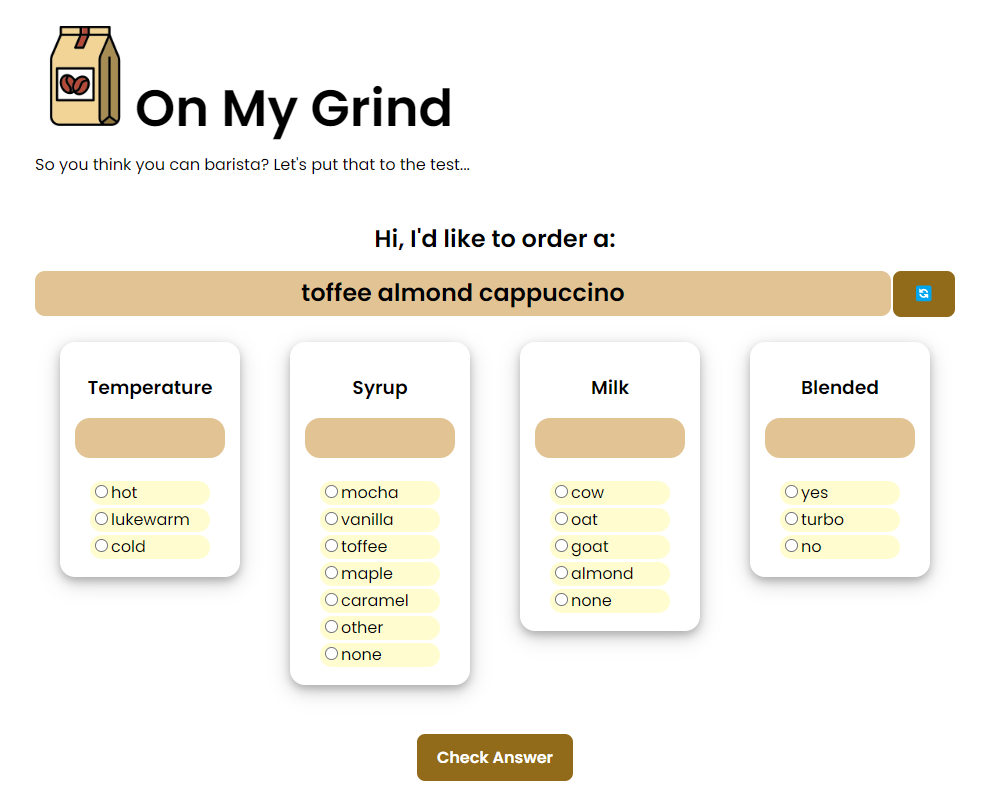
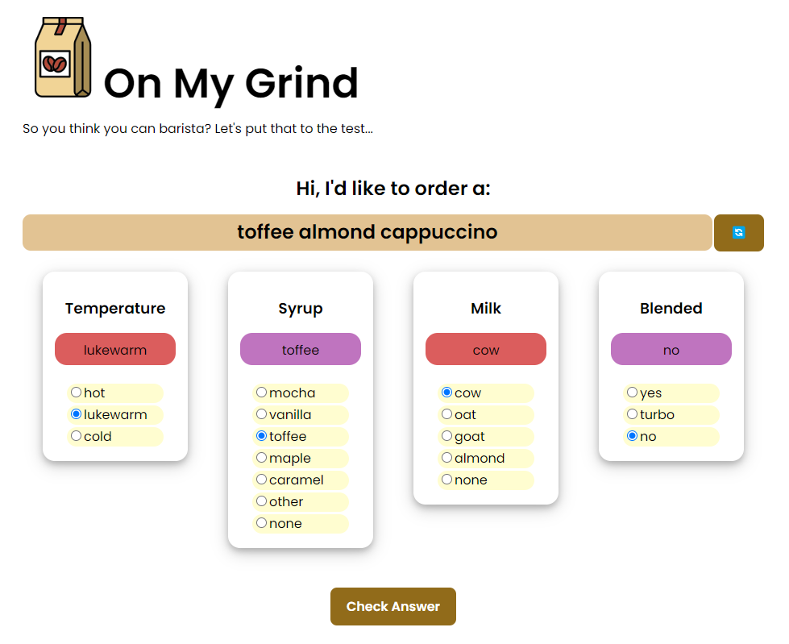

# Coffee-Codebreaker
Have you ever wanted to work at Starbucks? You’re about to be one step closer. In this app inspired by Wordle, memorize coffee drink recipes and quiz yourself on a random real (and possibly discontinued 😉) Starbucks drink’s temperature, flavor, milk type, and blendedness. The app will let you know if you’re a natural at barista-ing


## Pictures Walkthrough

Here's a walkthrough shows the game:



==================================================

<!-- Replace this with whatever GIF tool you used! -->


## Setup/Run Steps

### Dependencies

* [Vite](https://www.npmjs.com/package/vite)
* [Vite React Plugin](https://www.npmjs.com/package/@vitejs/plugin-react)
* [React](https://www.npmjs.com/package/react)
* [React-DOM](https://www.npmjs.com/package/react-dom)

---

### Install Dependencies

Before installing dependiencies, you will need `node` and `npm` installed globally on your machine by installing  [NodeJS](https://nodejs.org/en/download/) onto your machine.

To install the dependencies, run:

```sh
npm install
```

Alternatively, you can install the dependencies individually:

```sh
npm install vite
npm install @vitejs/plugin-react
npm install react
npm install react-dom
```

---

### Run Coffee-Codebreaker

In the repo directory, run the following in your terminal:

```sh
npm run dev

```

Visit the web application in the browser:

```html
http://localhost:5173/
```

<br/>

---
<!--

### Deploy Community Board

To deploy this application on Netlify, run the following in your terminal:
```sh
npm install
npm run build
```

Upload the generated `dist` file to Netflify at:
```html
https://app.netlify.com/drop
```
-->
*Last Updated: February 2023*

View an example of what was implemented [here](https://quiet-macaron-ca013a.netlify.app/)!


